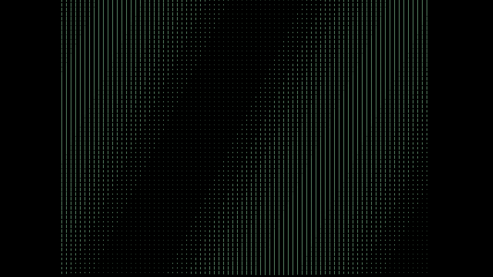

# Cinquain Wave Implemented with `vbPixelGameEngine`



## Description

This project is a mesmerizing wave visualization implemented with VB.NET, using [@DualBrain](https://github.com/DualBrain)'s `vbPixelGameEngine` library (legacy version), and **.NET 8.0 SDK for backward compatibility**. It creates an authentic Cinquain Wave pattern that flows smoothly across the screen with customizable colors, and can be customized to fit various display requirements (see [Customization Tips](#customization-tips)).

## Features

- **Authentic Wave Pattern**: Uses mathematical sine functions to generate realistic wave motion
- **Smooth Animation**: Real-time wave propagation with adjustable update intervals
- **Customizable Colors**: Both foreground and background colors can be customized using `Presets` enum values
- **Full-Screen Display**: Optimized for full-screen viewing experience
- **Escape Key Support**: Easy exit with ESC key

## Project Structure

```
VBPGE-Cinquain-Wave/
├── Program.vb          # Main application code
├── VBPGE Cinquain Wave.vbproj  # Project configuration
├── README.md           # This file
├── LICENSE             # BSD 3-Clause License
└── screenshot.png      # Project screenshot
```

## Requirements

- [.NET 8.0 SDK](https://dotnet.microsoft.com/download/dotnet/8.0) or later
- `vbPixelGameEngine.dll` library included in the project

## Installation

1. Clone the repository:
```bash
git clone https://github.com/Pac-Dessert1436/VBPGE-Cinquain-Wave.git
cd VBPGE-Cinquain-Wave
```

2. Ensure `vbPixelGameEngine.dll` is in the project directory

3. Build and run:
```bash
dotnet build
dotnet run
```

## Code Overview

### Key Components

**Matrix Initialization** (`OnUserCreate`):
- Creates an 80×60 grid for wave simulation
- Initializes with a sine wave pattern using `Math.Sin()`
- Values range from 0 to 17 (configurable via `THRESHOLD`)

**Wave Animation** (`UpdateEachCell`):
- Updates wave pattern using phase shifting
- Creates smooth, flowing wave motion
- Adjustable animation speed via `UPDATE_INTERVAL`

**Rendering** (`DrawEachCell`):
- Draws vertical lines representing wave amplitude
- Uses `Presets.Mint` for wave color (customizable)
- Black background (customizable via `Presets`)

### Customization Tips

**Color Customization**:
```vb
' Change wave color
DrawLine(x, y - lineHeight, x, y + lineHeight, Presets.Cyan)

' Change background color
Clear(Presets.DarkBlue)
```

**Wave Parameters**:
```vb
Private Const CELL_SIZE As Integer = 10         ' Grid cell size
Private Const UPDATE_INTERVAL As Single = 0.5F  ' Animation speed
```

**Wave Pattern**:
Modify the sine function parameters in `CalculateWaveValue()`:
```vb
Return Math.Sin(i * 0.1 + j * 0.05 + phase) * (CELL_SIZE / 2) + (CELL_SIZE / 2)
```

## Technical Details

### Wave Algorithm
The Cinquain Wave uses a 2D sine wave function:
- Horizontal frequency: `i * 0.1`
- Vertical frequency: `j * 0.05` 
- Phase shift: `phase` (increments for animation)
- Amplitude scaling: `THRESHOLD / 2`

### Performance
- 80×60 grid (4800 cells) updated at 2 FPS (configurable)
- Efficient rendering using line drawing
- Minimal memory footprint

## Usage

1. Run the application
2. Watch the wave flow across the screen
3. Press ESC to exit

## Development

### Building from Source
```bash
dotnet restore
dotnet build --configuration Release
```

### Modifying the Code
Key areas for customization:
- `DrawEachCell()`: Change rendering style
- `UpdateEachCell()`: Modify wave behavior
- Color presets: Use any `Presets` enum value

## Dependencies

- **vbPixelGameEngine**: Graphics and game engine library
- **.NET 8.0**: Runtime environment

## Contributing

Contributions are welcome! Please feel free to submit pull requests or open issues for bugs and feature requests.

## Acknowledgments

- **vbPixelGameEngine** for providing the graphics framework
- Mathematical wave algorithms for realistic simulation

## License

This project is licensed under the BSD 3-Clause License. See the [LICENSE](LICENSE) file for details.